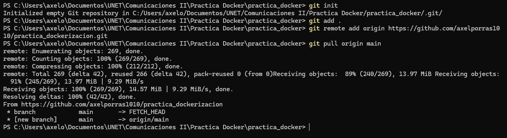
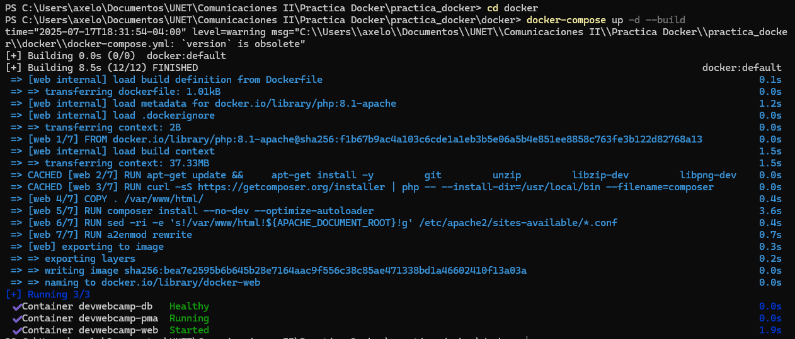
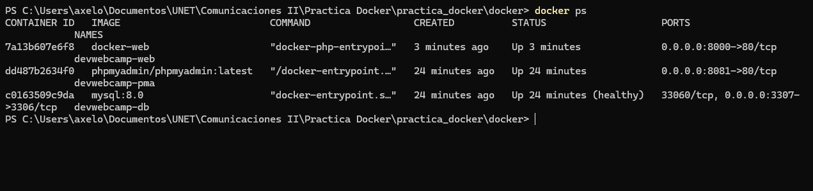
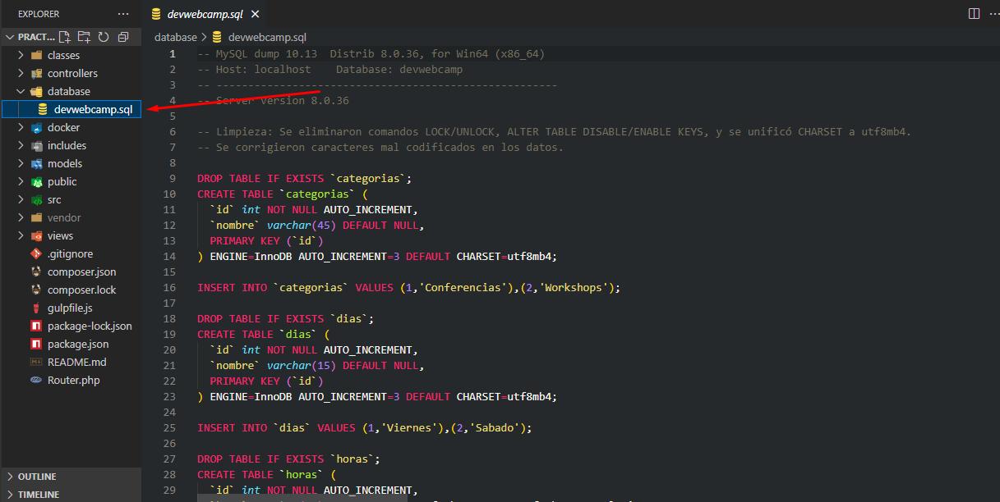
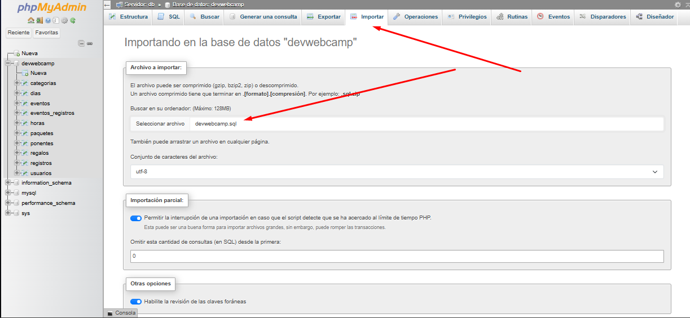
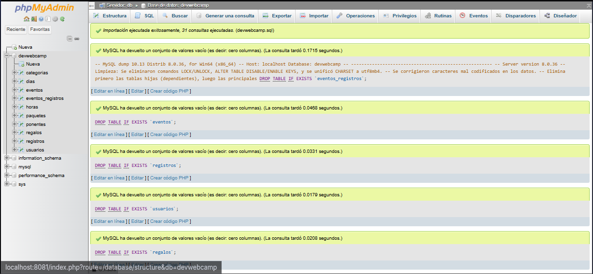
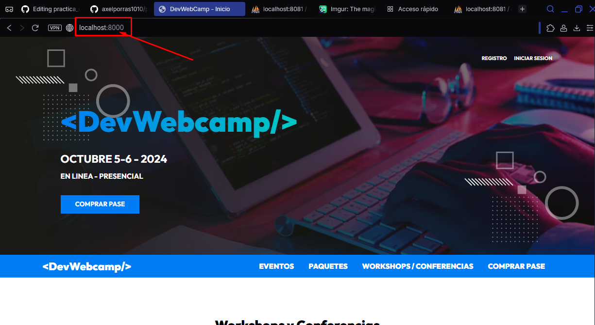

# Pracica de corte I 🐋

Practica en la que se hace un despliegue para hostear una app web sencilla realizada en PHP la cual modula un MVC similar al de LARAVEL
Todas las dependencias se encuentran dentro del docker.compose.yaml para poder realizar una instalación rápida y sin inconvenientes.

Pasos a seguir para poder probar la aplicación web:

1 - Usar este repositorio publico de git y hacer un pull al mismo para obtener todos los archivos y sus configuraciones: 

git init 

git add . 

git remote add origin https://github.com/axelporras1010/practica_dockerizacion.git 

git pull origin main  

2 - Entrar a la carpeta de docker para comenzar el proceso de levantamiento de los contendores y consecuentemente hacer el levantamiento con: docker-compose up -d --build
cd docker
docker-compose up -d --build

3 - Revisar los contenedores 
docker ps

4- Ahora vamos a ir a PHPMyAdmin para importar la base de datos. El archivo SQL del cual se puede importar se encuentra dentro del proyecto:

5- Ahora ya con todo funcional vamos a dirigirnos a la URL donde se encuentra hosteado el proyecto 

http://localhost:8000 -> Ubicacion del contenedor de apache y donde se encuentra alojado el proyecto como tal
http://localhost:8081/index.php -> Ubicacion del contenedor que tiene el PHPMyAdmin en caso de querer administrar la base de datos de forma mas visual

🛠 Requisitos Previos
Docker y Docker Compose instalados.

Puerto 8000 libre (para Apache/PHP) y 8081 (para PHPMyAdmin).

